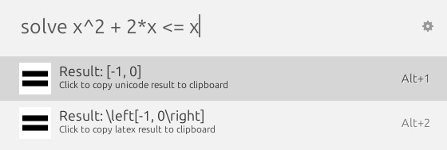

# ULauncher Math Solver

Solve math equations and inequalities using SymPy inside [ULauncher](https://ulauncher.io/).

## Features

- Supports solving equations and inequalities like `x^3 = 8` or `2*x > sqrt(2)`
- Provides answers in both Unicode and LaTeX formats

## Installation

1. Open ULauncher and go to the settings (through the settings icon in the top right)
2. Go to Extensions and click `+ Add Extension`
3. Paste the link to this repository: https://github.com/JerryV22/Ulauncher-math-solver

## Usage

- Open ULauncher and type `solve`, then enter your equation or inequality, for example:  
  `solve x^2 + 2*x <= x`
- To use a different keyword for the extension, change it in ULauncher settings.

## Example

## Note

For symbols without corresponding Unicode characters, the Unicode output may look weird.  
In those cases, it is recommended to use the LaTeX format.
